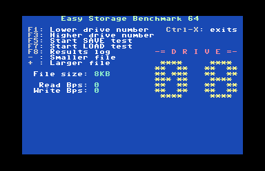
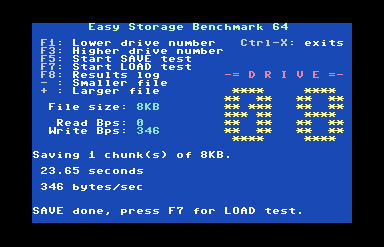
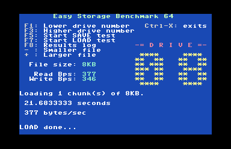
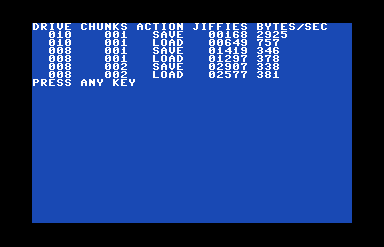
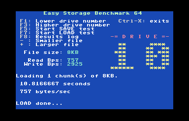
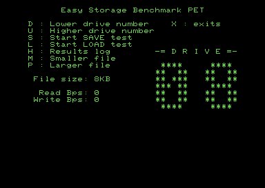
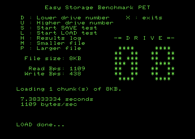
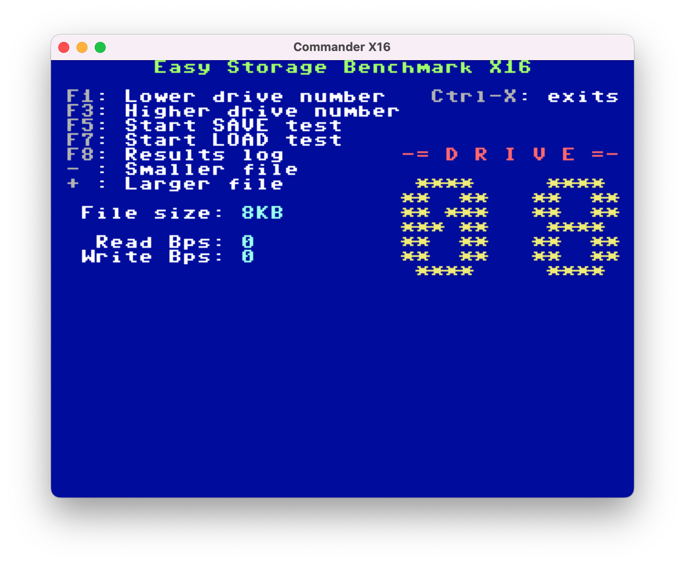
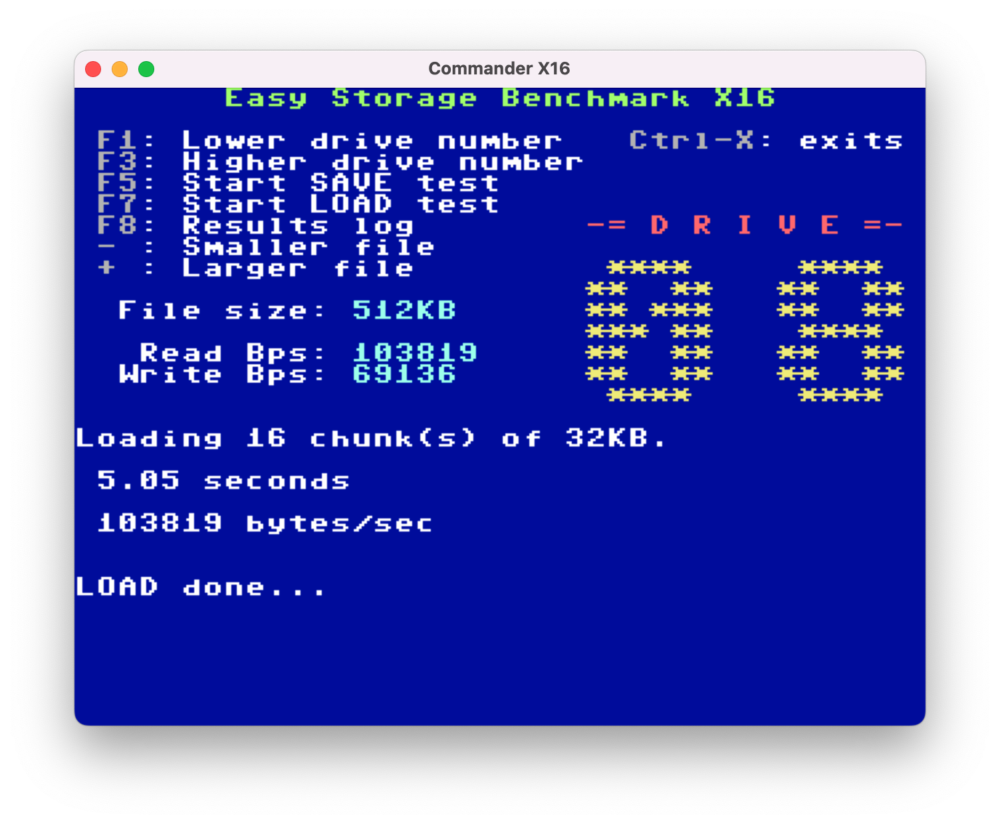

# Easy Storage Benchmark

Easy Storage Benchmark (ESB) is tool to test the performance of various storage devices on Commodore 64/PET or Commander X16 computers.

ESB is written in [Prog8](https://github.com/irmen/prog8) a high-level language for 6502 based computers.

Currently three platforms are supported; Commodore 64, Commodore PET 4032/8032 and Commander X16.  Additional platforms Like Commodore 128 or VIC-20 as well as Mega65 will be added at some point.

ESB uses the kernal load & save routines and should work with any devices where those work properly.

## Usage

Download `esb64.prg`, `esbx16.prg` or `esbpet.prg` from the [release](./release/) directory.
There is also `esb.d64` which can be attached to VICE or used on an SD2IEC etc.

Run on a C64 with:
```
LOAD"ESB64",8
RUN
```

Run on a PET with:
```
LOAD"ESBPET",8
RUN
```

Or on Commander X16:
```
LOAD"ESBX16"
RUN
```

C64/X16 Keys:
 - F1: Increase device number
 - F3: Decrease device number
 - F5: Execute SAVE test on current device
 - F7: Execute LOAD test on current device (run SAVE test first to create files)
 - F8: Show a log of LOAD/SAVE tests with device numbers and chunks / size.
 - '+': Increase number of size / quantity of chunks SAVEd or LOADed.
 - '-': Decrease number of size / quantity of chunks SAVEd or LOADed.
 - Ctrl-X: exit

Since the Commodore PET keyboards don't have function keys and the 4038 and 8032 have different layouts, the keys are reduced to just basic letters.

PET Keys:
 - U: Increase device number
 - D: Decrease device number
 - S: Execute SAVE test on current device
 - L: Execute LOAD test on current device (run SAVE test first to create files)
 - H: Show a log of LOAD/SAVE tests with device numbers and chunks / size.
 - P: Increase number of size / quantity of chunks SAVEd or LOADed.
 - M: Decrease number of size / quantity of chunks SAVEd or LOADed.
 - X: exit

## Commodore 64 (& Commodore 128 in GO64 mode)

Hardware known to work on C64:
 - VICE 1541, CMD HD, IDE64
 - Real 1541, CMD HD, IDE64

Here are a couple of screenshots of ESB64 in action on the VICE emulator.

Launch screen:



After doing a save:



After doing a load:



Showing the log after several tests:




ESB64 works less reliably with the VICE host file-system.  This is a known issue with VICE and/or Prog8 where results are inconsistent or hang.  Since ESB is meant for benchmarking real hardware it shouldn't be a big issue, but keep it in mind when testing with VICE.  Hopefully I'll figure out a way to workaround the issues eventually, but for now realize it isn't reliable.

After doing a save/load to a VICE host file-system on device 10:




## Commodore PET

Hardware known to work:
 - VICE `xpet -model 4032` or `xpet -model 8032`
 - 40 or 80 column screen
 - Tynemouth MiniPET with SD2PET
 - PET 4032 with .. (TBD)

Here are a couple of screenshots of ESBPET in action on the VICE xpet emulator.

Launch screen:




After doing a save & load:




## Commander X16 (& OtterX)

Hardware known to work on X16:
 - x16emu sd card and hostfs
 - Real hardware SD card
 - Real hardware IEC port (with some caveats)

Here are a couple of screenshots of ESBX16 in action on the X16 emulator.

Launch screen:




After doing a save & load:




